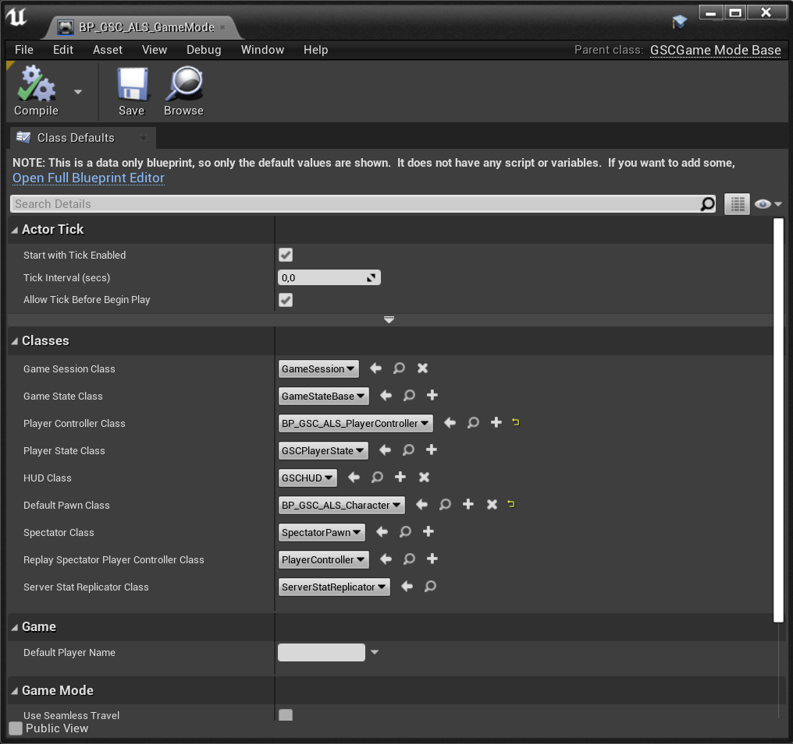
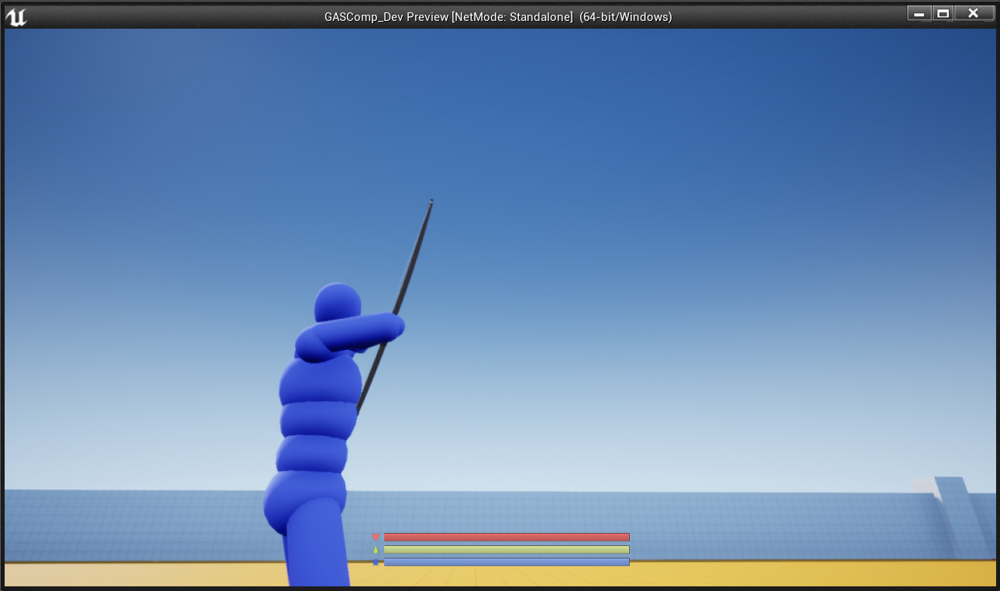
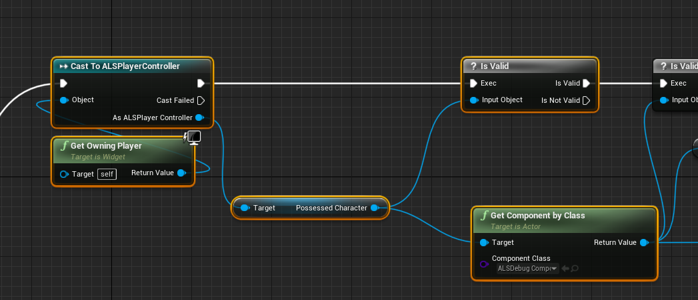
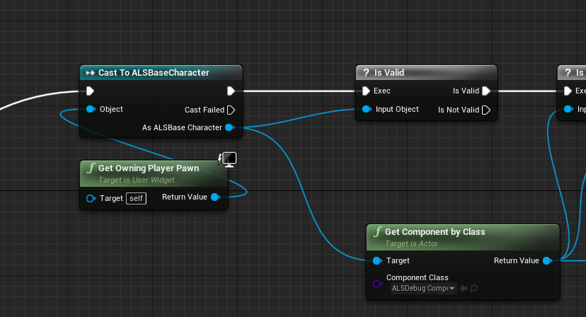

# GASCompanionALS

Plugin integrating both [GASCompanion](https://gascompanion.github.io/) and [ALSV4_CPP](https://github.com/dyanikoglu/ALS-Community)

**Curent version** 3.0.0 for 4.27 (If you need previous versions for lower version of the engine, check the [Releases](https://github.com/GASCompanion/GASCompanionALS/releases) page and download the appropriate version)

## Usage

1. Clone the repository into your Project's Plugin directory.
2. Install [ALSV4_CPP](https://github.com/dyanikoglu/ALS-Community) separately, also in your Project's Plugin directory.
3. In the Editor, Enable GASCompanion, ALSV4_CPP and GASCompanionALS
4. Create a GameMode blueprint with the following classes configuration (or use `BP_GSC_ALS_GameMode`)

5. Configure your level to use this game mode
6. Profit

## Fix Debug Component

If your debug component is not working properly, you need to change something in `ALS_HUD` Widget Blueprint.

From this

to this

